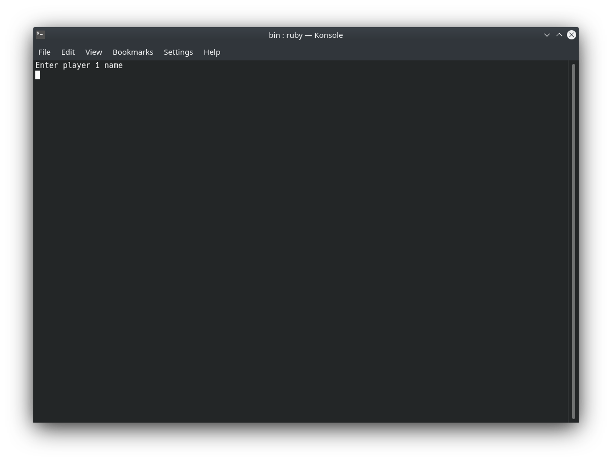

# Tic-Tac-Toe


## Project Description

> This is a Tic-Tac-Toe game made with ruby


## Game Rules

* The game is played on a grid that's 3 squares by 3 squares.

* You are X, your friend (or the computer in this case) is O. ...

* The first player to get 3 of their marks in a row (up, down, across, or diagonally) is the winner.

* When all 9 squares are full, the game is over

## How to play this game

* Clone the repo

* Navigate to bin folder and run ```main.rb```


* Press Enter to start playing


* Press ```s``` and ```Enter``` to start



* Enter player names


* Start playing (Player 1 is ```'X'``` and Player 2 is ```'O'```) 


* To Mark a spot on the Board you can use the coordinates to the left and bottom of the board. eg. ```A2``` 

* Note: Make sure you start  with the letters ```'A'``` or ```'B'``` or ```'C'```.


* After finishing a game, you can choose to play another game by pressing ```'r'```


* You can press ```'q'``` to quit the game.

## Built With

- Ruby

## Live Demo

[Live Version](https://repl.it/@sinansevgi/Tic-Tac-Toe#main.sh)

## Authors

👤 **Binyam Hailemeskel**

- GitHub: [@bini-i](https://github.com/bini-i)
- Twitter: [@binyamshewa](https://twitter.com/binyamshewa)
- LinkedIn: [LinkedIn](https://www.linkedin.com/in/binyam-hailemeskel-728048151/)

👤 **Sinan Sevgi**

- GitHub: [@sinansevgi](https://github.com/sinansevgi)
- LinkedIn: [@sinansevgi](https://www.linkedin.com/in/sinan-s-52559437/)

## 🤝 Contributing

Contributions, issues, and feature requests are welcome!

## Show your support

Give a ⭐️ if you like this project!

## 📝 License

This project is [MIT](./LICENSE) licensed.
